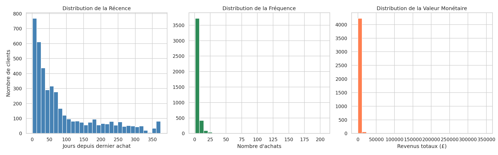
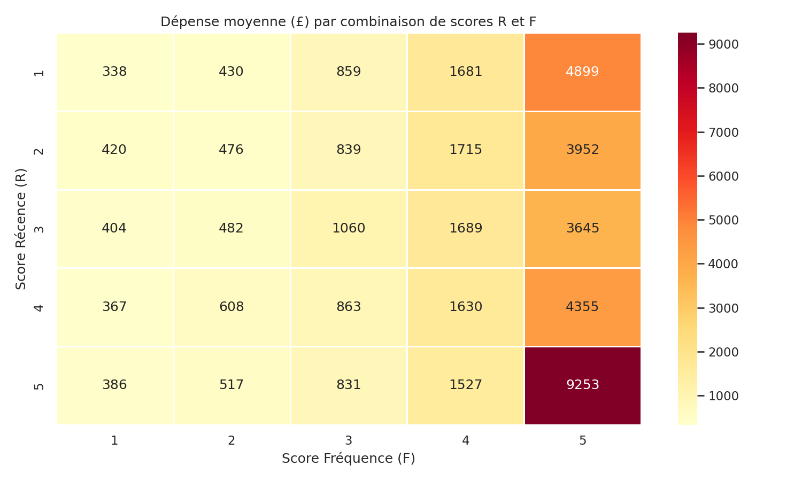
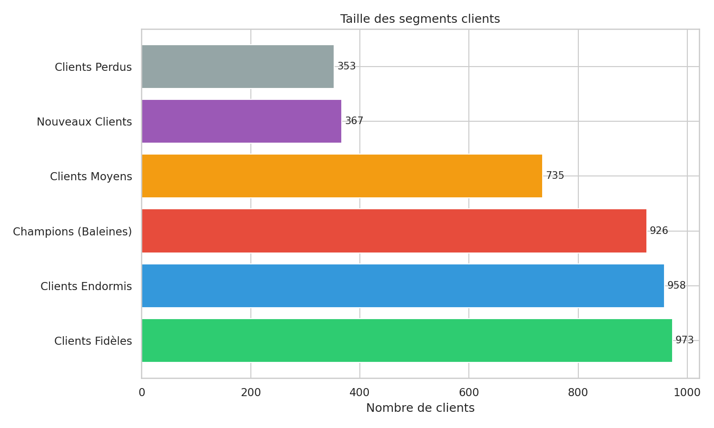
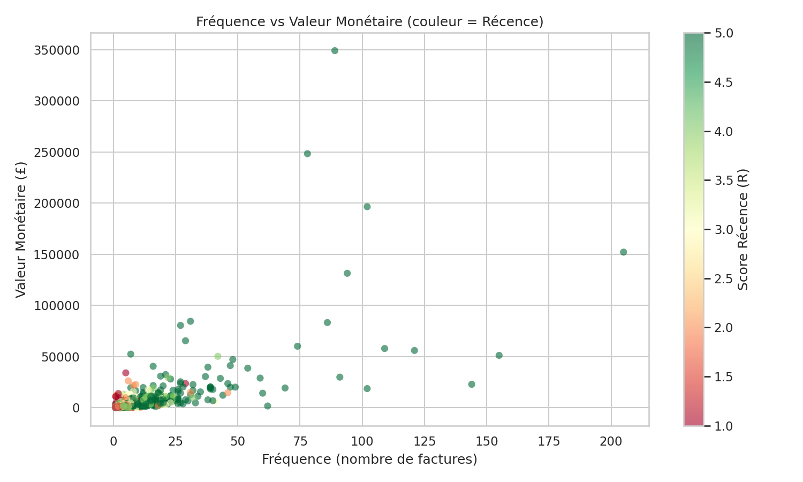

# Analyse RFM – Online Retail II

Segmentation clients par analyse RFM (Récence, Fréquence, Valeur Monétaire) sur le jeu de données UCI Online Retail II.

---

## 📦 Dataset

- **Source** : [UCI Machine Learning Repository – Online Retail II](https://archive.ics.uci.edu/dataset/502/online+retail+ii)
- **Période** : Décembre 2009 – Décembre 2010
- **Volume brut** : 525 461 transactions, 8 colonnes
- **Licence** : CC BY 4.0

| Colonne | Description |
|---|---|
| `Invoice` | Identifiant de facture (préfixe `C` = annulation) |
| `StockCode` | Code produit |
| `Description` | Nom du produit |
| `Quantity` | Quantité achetée |
| `InvoiceDate` | Date et heure de la transaction |
| `Price` | Prix unitaire en £ |
| `Customer ID` | Identifiant client unique |
| `Country` | Pays du client |

---

## 🗂️ Structure du projet

```
rfm/
├── data/
│   ├── online_retail_II.xlsx        # Données brutes (non versionnées)
│   └── cleaned_online_retail.csv    # Données nettoyées
├── notebooks/
│   ├── data_cleaning.ipynb          # Nettoyage et exploration
│   ├── rfm_metrique.ipynb           # Calcul des métriques RFM
│   ├── visualisation.ipynb          # Visualisations et interprétation
│   └── figures/
│       ├── histogrammes_rfm.png
│       ├── heatmap_R_F.png
│       ├── scatter_F_M_R.png
│       └── segments_barres.png
├── .gitignore
└── README.md
```

---

## ⚙️ Installation

```bash
# Cloner le dépôt
git clone https://github.com/ndaoalassane1634/rfm.git
cd rfm

# Installer les dépendances
pip install pandas numpy matplotlib seaborn openpyxl jupyter

# Télécharger le dataset
mkdir -p data && cd data
wget https://archive.ics.uci.edu/static/public/502/online_retail_ii.xlsx -O online_retail_II.xlsx
cd ..
```

---

## 🔄 Étapes du projet

### 1. Nettoyage des données (`data_cleaning.ipynb`)
- Suppression des lignes sans `Customer ID` (~108 000 lignes)
- Suppression des annulations (Invoice commençant par `C`)
- Suppression des quantités et prix négatifs ou nuls
- Conversion de `InvoiceDate` en datetime
- Création de la colonne `Revenue = Quantity × Price`
- **Résultat** : dataset nettoyé sauvegardé dans `data/cleaned_online_retail.csv`

### 2. Calcul des métriques RFM (`rfm_metrique.ipynb`)
- **Récence** : nombre de jours depuis le dernier achat
- **Fréquence** : nombre de factures uniques par client
- **Monétaire** : somme des revenus par client
- Attribution de scores 1 à 5 par quintiles
- Score global `RFM_Score = R + F + M`

### 3. Segmentation des clients
| Segment | Critères |
|---|---|
| Champions (Baleines) | R ≥ 4, F ≥ 4, M ≥ 4 |
| Nouveaux Clients | R ≥ 4, F ≤ 2 |
| Clients Fidèles | R ≥ 3, F ≥ 3 |
| Clients Perdus | R ≤ 2, M ≥ 4 |
| Clients Endormis | R ≤ 2, F ≤ 2 |
| Clients Moyens | Autres |

### 4. Visualisations (`visualisation.ipynb`)

- Histogrammes des distributions R, F, M


- Heatmap de la dépense moyenne par combinaison de scores R et F


- Diagramme en barres de la taille des segments


- Nuage de points Fréquence vs Monétaire coloré par Récence

---

## 📊 Résultats clés

- **Distribution asymétrique** : la majorité des clients achète peu et dépense peu — structure typique d'un e-commerce B2B/B2C mixte
- **La fréquence est le principal levier** : les clients F=5 dépensent en moyenne 3 600£ à 9 253£ quelle que soit leur récence
- **Champions (R=5, F=5)** : dépense moyenne de **9 253£**, à fidéliser en priorité
- **Quelques gros comptes** (grossistes) génèrent une part disproportionnée du CA — jusqu'à 350 000£ par client

---

## 💡 Recommandations marketing

| Segment | Stratégie |
|---|---|
| Champions | Programme VIP, accès anticipé nouveautés, récompenses exclusives |
| Nouveaux Clients | Onboarding, offre de bienvenue, encourager le 2e achat |
| Clients Fidèles | Ventes croisées, programme de points |
| Clients Perdus | Campagne de ré-engagement, offre promotionnelle ciblée |
| Clients Endormis | Email de réactivation ou suppression de la base |

---

## 🌿 Branches Git

| Branche | Contenu |
|---|---|
| `main` | Code stable et intégré |
| `data-cleaning` | Nettoyage et exploration des données |
| `rfm-analysis` | Calcul des métriques et segmentation |
| `visualisation` | Graphiques et interprétation |

---

## 📄 Licence

Données source sous licence **CC BY 4.0** – UCI Machine Learning Repository.